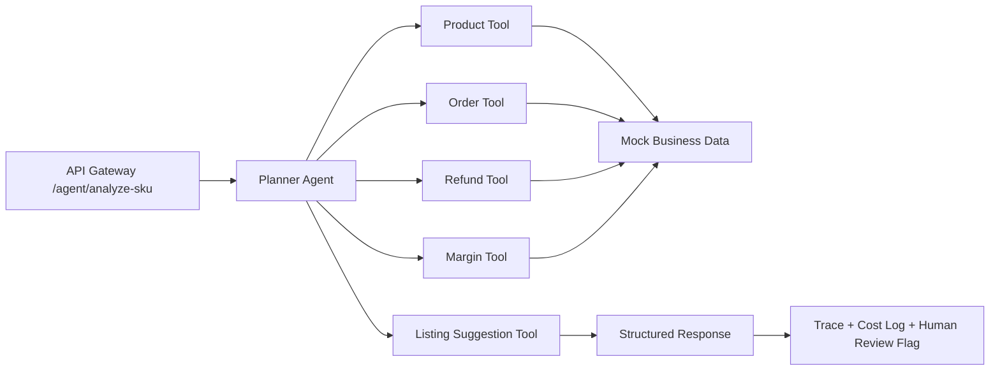

# Cross-border Ecommerce Agent Gateway

[](https://www.python.org/)
[](https://fastapi.tiangolo.com/)
[](LICENSE)
[](#evaluation)

一个轻量 Python Agent 应用项目：把跨境电商的商品、订单、退款、利润等内部业务系统抽象成 tools，通过一个 Agent gateway 输出结构化运营诊断、证据字段、风险等级、人工复核标记、trace 和成本估算。

## Why This Matches

- **Agent 应用**：模拟 Planner Agent 编排商品、订单、退款、利润、listing 建议工具。
- **嵌入业务链路**：用 FastAPI 暴露 `POST /agent/analyze-sku`，模拟接入内部运营系统。
- **稳定性与兜底**：工具缺失时返回 partial/fallback，不编造证据；高风险触发 human-in-the-loop。
- **调用成本**：固定短 prompt、按需 tool use、缓存工具读取、输出 cost log。
- **二次开发表达**：以 OpenAI Agents SDK 的核心机制为对照，把 `tool use / guardrail / tracing / MCP` 等概念落到电商场景。

## Architecture



## Project Structure

```
cross_border_agent_gateway/
├── app/
│   ├── agent.py          # Planner Agent：编排工具、生成诊断与建议
│   ├── api.py            # FastAPI 入口，暴露 /agent/analyze-sku
│   ├── simple_server.py  # 零依赖 demo server（标准库实现）
│   ├── cli.py           # 命令行离线运行入口
│   ├── tools.py         # 商品/订单/退款/利润/listing 工具
│   ├── data_store.py    # mock 业务数据读取 + 缓存
│   └── schemas.py       # 请求/响应/trace/cost 的数据结构
├── data/                # 商品、订单、退款、利润 mock 数据
├── eval/                # 评测用例 + 评测脚本
├── tests/               # 单元测试
├── docs/                # 框架对照、面试材料
├── requirements.txt
└── README.md
```

## Tech Stack

- **Python 3.10+** — `dataclass` + 类型注解构建强类型 schema
- **FastAPI + Uvicorn** — 生产形态的 API gateway
- **标准库 HTTP server** — `simple_server.py` 提供零依赖 demo
- **unittest + 自研 eval** — 覆盖核心业务场景

## Run Offline

```bash
python -m app.cli --sku SKU-USB-C-001 --marketplace US
```

## Run API

No-dependency demo server:

```bash
python -m app.simple_server
```

FastAPI version:

```bash
pip install -r requirements.txt
uvicorn app.api:app --reload
```

Then call:

```bash
curl -X POST http://127.0.0.1:8000/agent/analyze-sku ^
  -H "Content-Type: application/json" ^
  -d "{\"sku\":\"SKU-USB-C-001\",\"marketplace\":\"US\",\"question\":\"这个 SKU 在美国站转化差，帮我分析并给出调价和 listing 优化建议\",\"operator_role\":\"operator\"}"
```

## Response Shape

返回的结构化结果包含证据、建议、风险等级、人工复核标记、trace 和成本：

```jsonc
{
  "sku": "SKU-USB-C-001",
  "marketplace": "US",
  "status": "ok",
  "summary": "转化率偏低，主要受定价与 listing 影响……",
  "evidence": { "conversion_rate": 0.012, "margin": 0.18, "refund_rate": 0.03 },
  "recommendations": ["下调售价至 $19.9", "优化主图与五点描述"],
  "risk_level": "medium",
  "human_review_required": false,
  "missing_evidence": [],
  "tool_results": [{ "name": "product", "ok": true, "data": { } }],
  "trace": [{ "step": "plan", "detail": "选择 product/order/margin 工具" }],
  "cost": {
    "prompt_tokens_estimate": 320,
    "completion_tokens_estimate": 180,
    "tool_calls": 4,
    "cache_hits": 1,
    "estimated_cost_usd": 0.0009
  }
}
```

## Evaluation

```bash
python eval/run_eval.py
python -m unittest discover -s tests
```

The eval checks 5 interview-friendly cases: low conversion, healthy SKU, high refund, unknown SKU fallback, and repeated SKU cache behavior.

## Interview Talking Points

- 输入不是自由聊天，而是带 `sku / marketplace / question / operator_role` 的业务请求。
- Agent 不直接访问数据库，所有内部系统都通过 typed tools 暴露。
- 输出必须带 evidence，避免“看起来很聪明但没有证据”的建议。
- 高风险决策不自动执行，必须进入人工复核。
- 这不是伪造 OpenClaw/Hermes 上线经验，而是用轻量 Python 项目覆盖 JD 里的 Agent 工程关键环节。

## License

本项目基于 [MIT License](LICENSE) 开源。
